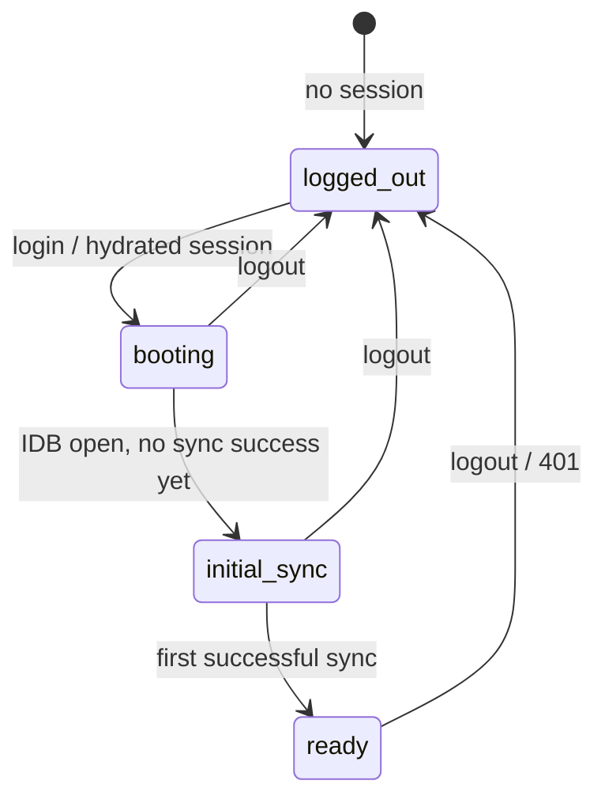

# Integration guide (offline-first SPAs)

[Documentation index](./README.md) · [Getting started](./GettingStarted.md) · [React](./React.md) · [Auth listeners](./Auth.md) · [Sync engine](./Sync.md)

How to build SPAs and PWAs where IndexedDB is the runtime database and the network is asynchronous. Use this after [Getting started](./GettingStarted.md) for routing, app shell phases, and integration rules. UI code lives in [React](./React.md).

## Checklist

1. **`db.ts`** — `AppDb extends DbSyncR`, adapter, `onLogout` / optional `onAuthenticated` **before any `await`**
2. **Router** — initial route from **`db.auth.isLoggedIn`** at module load (not `onAuthenticated` on refresh)
3. **`AppShell`** — `db.auth.phase$.use()` with all four phases ([React — App shell](./React.md#app-shell))
4. **Lists** — `useDbQuery(db, …)` per table; skeletons when `loading`, not a global block on `ready`
5. **Scripts / handlers** — `await db.waitForBooted()` before first `db.posts.*` (components usually skip this)

## Mental model

- **`db.auth.isLoggedIn`** — hydrated from `localStorage` at module load; use for **first-paint routing**.
- **`db.auth.phase`** — single switch for app shell (`logged-out` \| `booting` \| `initial-sync` \| `ready`).
- **`db.auth.onLogout(fn)`** — subscribe before any `await`; runs in parallel, awaited before IDB clear on active-tab logout. **Never on refresh.**
- **`db.auth.onAuthenticated(fn)`** — optional; runs on **`login()`** and cross-tab **`AUTH_LOGIN` only** — **not** refresh boot.
- **Boot (automatic)** — internal `sync.start()` when hydrated; does **not** call `onAuthenticated`.
- **`db.waitForBooted()`** — boot pipeline finished. Not server validation or a completed pull — see [Sync](./Sync.md).

**Router rule:** initial route = **`db.auth.isLoggedIn` at module load**.

**Loading rule:** drive the React shell with **`db.auth.phase$.use()`** and handle all four phases. Use skeletons / `useDbQuery` `loading` for per-query loading when `phase === "ready"`. Use **`isInitialSyncPending$`** only when you want one loader for the whole logged-in, not-yet-synced window ([alternative](#alternative-one-loader-until-first-sync)).

**Data rule (imperative code):** `await db.waitForBooted()` before the first `db.posts.*` / `db.put` in scripts, tests, or event handlers. React components usually skip it — `useDbQuery` waits for `db.auth.isReady`.

**Sync rule:** do not put `await db.sync.waitForLive()` in `onAuthenticated` if you want the shell visible immediately.

Listener matrix: [Auth](./Auth.md).

## Phase flow



`isInitialSyncPending$` is true for both **`booting`** and **`initial-sync`** while logged in (until the first successful sync).

## Session & shell reference

| Signal | Meaning | Typical UI |
| --- | --- | --- |
| `phase` / `phase$` | `logged-out` → `booting` → `initial-sync` → `ready` | `AppShell` switch — [React](./React.md#app-shell) |
| `isLoggedIn` | Hydrated client session | Router guard at module load |
| `isInitialSyncPending` / `isInitialSyncPending$` | Logged in, no successful sync since login | Optional one loader for boot + sync ([alternative](#alternative-one-loader-until-first-sync)) |
| `isBooted` | Boot pipeline finished | — |
| `isReady` | IndexedDB open | `useDbQuery` gate |
| `isBootstrapping` | Session-start or `onAuthenticated` callbacks in flight | Spinner on boot skeleton |
| `pendingLogout` | Remote logout queued until online | — |
| `offline` / `online` | Browser connectivity | Sync / login errors |
| `db.sync.state` / `state$` | `idle` \| `syncing` \| `offline` \| `error` | Initial-sync screen |
| `waitForBooted()` | Boot finished; `sync.start()` scheduled when logged in | Scripts / tests |
| `db.sync.waitForLive()` | Recent successful sync | Optional; see [Sync](./Sync.md) |

Full getter tables: [API reference](./API.md#dbauth-dbsyncauth).

## Anti-patterns

| Don't | Do instead |
| --- | --- |
| Route refresh boot on `onAuthenticated` | `db.auth.isLoggedIn` at module load; optional `onAuthenticated` only after `login()` |
| Full-page loader from `!db.sync.isLive` or `waitForLive()` | `phase$.use()` with `initial-sync` case, or `isInitialSyncPending$` for one combined loader |
| `switch (phase)` missing `initial-sync` | Handle all four phases; `default: null` hides the sync screen |
| One loader for boot + sync but only `case "initial-sync"` | `isInitialSyncPending$.use()` or same loader for `booting` and `initial-sync` |
| `await db.sync.waitForLive()` inside `onAuthenticated` | Show shell; let `useDbQuery` load per table |
| `await db.waitForBooted()` at module top level in SPAs | `db.auth.*$.use()` + `useDbQuery` in components |
| Register `onLogout` / `onAuthenticated` after the first `await` | Same module, immediately after `new` |
| Expect `onLogout` on refresh | Refresh replays session silently; use `isLoggedIn` + phase |
| Use `!db.sync.isStarted` as “logged out” | `db.auth.isLoggedIn` / `phase` |
| Block all UI on `useDbQuery` `loading` when `phase === "ready"` | Shell visible; skeletons per query |
| Cache `GET /api/session` in a service worker while offline | Network-only or short TTL for session routes ([PWAs](#service-workers-pwas)) |

## Recipes

### Login → initial sync → ready

```typescript
// db.ts — listeners before any await
db.auth.onLogout(() => navigate("/login"))

// Router.tsx — module load
const authed = db.auth.isLoggedIn
```

Implement **`AppShell`** (`phase$.use()`, four cases) and **`useDbQuery`** — [React](./React.md).

### Alternative: one loader until first sync

When boot and initial sync should show the **same** full-page loader:

```tsx
const pending = db.auth.isInitialSyncPending$.use()
if (pending) {
  return <InitialSyncScreen offline={db.auth.offline} syncState={db.sync.state} />
}
// then switch on phase for logged-out / ready only
```

### Manual lifecycle (tests, strict ordering)

```typescript
const db = new AppDb({ adapter, lifecycle: { manual: true } })
await db.boot()
if (db.auth.isLoggedIn) await db.sync.start()
```

### Cross-tab logout (passive tab)

Passive tabs run `onLogout` listeners only — no IndexedDB wipe, no `adapter.logout()`. Route to login in the listener; do not assume local data was cleared in that tab.

## Offline auth behavior

- **`db.auth.sendCode()`** / **`login()`** throw `DbSyncOfflineError` when offline and `requiresAuth` — see [Errors](./Errors.md).
- When back **online**, dbsync revalidates; invalid session → `onLogout` listeners.
- **`db.auth.revalidate()`** — optional manual probe.

## Logout pipeline

1. Sync stops; `isLoggedIn` set false.
2. **`onLogout` listeners** run in parallel (`Promise.allSettled`).
3. IndexedDB cleared (active tab); sync cursor keys cleared.
4. Rejections propagate **after** step 3.
5. Remote `adapter.logout()` when online, or **`pendingLogout`** when offline.

Passive tabs: `AUTH_LOGOUT` over `BroadcastChannel` — listeners only, no IDB wipe, no `adapter.logout()`.

## Service workers (PWAs)

Session routes must not be served from cache while offline — stale `GET /api/session` makes the client think it is still logged in.

## See also

- [React](./React.md) — `DbSyncR`, `.use()`, `useDbQuery`
- [Auth listeners](./Auth.md) — callback matrix
- [Sync engine](./Sync.md) — dirty queue, leader tab
- [RestAdapter](./RestAdapter.md) — API endpoints
- [Migrating (archived)](./archive/Migrating-pre-0.0.43.md) — pre-0.0.43 API moves
