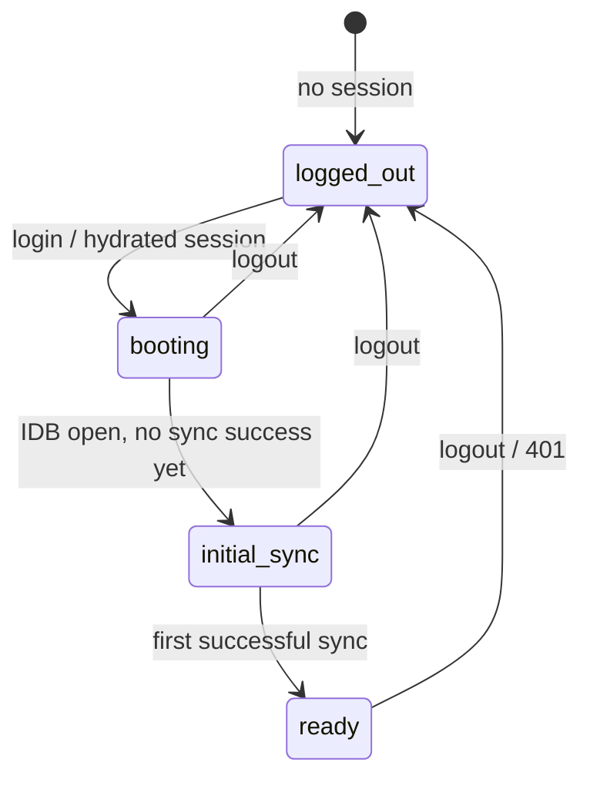

# Offline-first apps

[Documentation index](./README.md) · [Auth listeners](./Auth.md) · [Sync engine](./Sync.md)

How to build SPAs and PWAs where IndexedDB is the runtime database and the network is asynchronous. **Start here** for routing, app shell phases, and integration rules.

## Mental model

- **`db.auth.isLoggedIn`** — hydrated from `localStorage` at module load; use for **first-paint routing**.
- **`db.auth.phase`** — single switch for app shell (`logged-out` \| `booting` \| `initial-sync` \| `ready`).
- **`db.auth.onLogout(fn)`** — subscribe before any `await`; runs in parallel, awaited before IDB clear on active-tab logout. **Never on refresh.**
- **`db.auth.onAuthenticated(fn)`** — optional; runs on **`login()`** and cross-tab **`AUTH_LOGIN` only** — **not** refresh boot.
- **Boot (automatic)** — internal `sync.start()` when hydrated; does **not** call `onAuthenticated`.
- **`db.waitForBooted()`** — boot pipeline finished. Not server validation or a completed pull — see [Sync](./Sync.md).

**Router rule:** initial route = **`db.auth.isLoggedIn` at module load**.

**Loading rule:** `db.auth.phase === "initial-sync"` (or `db.auth.isInitialSyncPending`) for a full-page loader until the first successful sync (survives refresh). Use skeletons / `useDbQuery` `loading` for per-query loading when `phase === "ready"`.

**Data rule (imperative code):** `await db.waitForBooted()` before the first `db.posts.*` / `db.put` in scripts, tests, or event handlers. React components usually skip it — `useDbQuery` waits for `db.auth.isReady`.

**Sync rule:** do not put `await db.sync.waitForLive()` in `onAuthenticated` if you want the shell visible immediately.

Canonical setup (typed tables, env swap): [Getting started](./GettingStarted.md). Listener matrix: [Auth](./Auth.md).

## Phase flow



## Phase reference

| `phase` | Typical UI |
| --- | --- |
| `logged-out` | Login |
| `booting` | Boot skeleton (`db.auth.isBootstrapping` for spinner) |
| `initial-sync` | Full-page sync loader (use `db.auth.syncState` for error/offline) |
| `ready` | App shell + `useDbQuery` skeletons as needed |

## Auth getters

| Getter | Meaning |
| --- | --- |
| `isLoggedIn` | Client session flag (hydrated) |
| `isBooted` | Boot pipeline finished |
| `isReady` | IndexedDB open |
| `isBootstrapping` | Session-start or `onAuthenticated` callbacks in flight |
| `pendingLogout` | Remote logout queued until online |
| `offline` / `online` | Browser connectivity |
| `syncState` | Sync UI: `idle` \| `syncing` \| `offline` \| `error` |
| `isInitialSyncPending` | Logged in, no successful sync since login |

Full tables: [API reference](./API.md#dbauth-dbsyncauth).

## Anti-patterns

| Don't | Do instead |
| --- | --- |
| Route refresh boot on `onAuthenticated` | `db.auth.isLoggedIn` at module load; optional `onAuthenticated` only after `login()` |
| Full-page loader from `!db.sync.isLive` or `waitForLive()` | `db.auth.phase === "initial-sync"` until first sync since login |
| `await db.sync.waitForLive()` inside `onAuthenticated` | Show shell; let `useDbQuery` load per table |
| `await db.waitForBooted()` at module top level in SPAs | `useDbAuth` / `useDbQuery` in components |
| Register `onLogout` / `onAuthenticated` after the first `await` | Same module, immediately after `new DbSync` |
| Expect `onLogout` on refresh | Refresh replays session silently; use `isLoggedIn` + phase |
| Use `!db.sync.isStarted` as “logged out” | `db.auth.isLoggedIn` / `phase` |
| Block all UI on `useDbQuery` `loading` when `phase === "ready"` | Shell visible; skeletons per query |
| Cache `GET /api/session` in a service worker while offline | Network-only or short TTL for session routes ([PWAs](#service-workers-pwas)) |

## Recipes

### Login → initial sync → ready

```typescript
// db.ts — listeners before any await
db.auth.onLogout(() => navigate("/login"))

// Router.tsx — module load
const authed = db.auth.isLoggedIn

// AppShell.tsx
const { phase, offline, syncState } = useDbAuth(db)
switch (phase) {
  case "logged-out": return <Login />
  case "initial-sync": return <InitialSyncScreen offline={offline} syncState={syncState} />
  case "booting": return <BootSkeleton />
  case "ready": return <Outlet />
}
```

### Manual lifecycle (tests, strict ordering)

```typescript
const db = new AppDb({ adapter, lifecycle: { manual: true } })
await db.boot()
if (db.auth.isLoggedIn) await db.sync.start()
```

### Cross-tab logout (passive tab)

Passive tabs run `onLogout` listeners only — no IndexedDB wipe, no `adapter.logout()`. Route to login in the listener; do not assume local data was cleared in that tab.

## Offline auth behavior

- **`db.auth.sendCode()`** / **`login()`** throw `DbSyncOfflineError` when offline and `requiresAuth` — see [Errors](./Errors.md).
- When back **online**, dbsync revalidates; invalid session → `onLogout` listeners.
- **`db.auth.revalidate()`** — optional manual probe.

## Logout pipeline

1. Sync stops; `isLoggedIn` set false.
2. **`onLogout` listeners** run in parallel (`Promise.allSettled`).
3. IndexedDB cleared (active tab); sync cursor keys cleared.
4. Rejections propagate **after** step 3.
5. Remote `adapter.logout()` when online, or **`pendingLogout`** when offline.

Passive tabs: `AUTH_LOGOUT` over `BroadcastChannel` — listeners only, no IDB wipe, no `adapter.logout()`.

## React shell

```tsx
const { phase, offline, syncState, isBootstrapping } = useDbAuth(db)

switch (phase) {
  case "logged-out": return <Login />
  case "initial-sync": return <InitialSyncScreen syncState={syncState} offline={offline} />
  case "booting": return <BootSkeleton active={isBootstrapping} />
  case "ready": return <App />
}
```

Module-scoped `db`; pass it to hooks explicitly. Details: [React](./React.md).

## Service workers (PWAs)

Session routes must not be served from cache while offline — stale `GET /api/session` makes the client think it is still logged in.

## Manual lifecycle

`lifecycle: { manual: true }` — `await db.boot()` then `await db.sync.start()` when logged in.

## See also

- [Auth listeners](./Auth.md) — callback matrix
- [Sync engine](./Sync.md) — dirty queue, leader tab
- [RestAdapter](./RestAdapter.md) — API endpoints
- [Migrating (archived)](./archive/Migrating-pre-0.0.43.md) — pre-0.0.43 API moves
