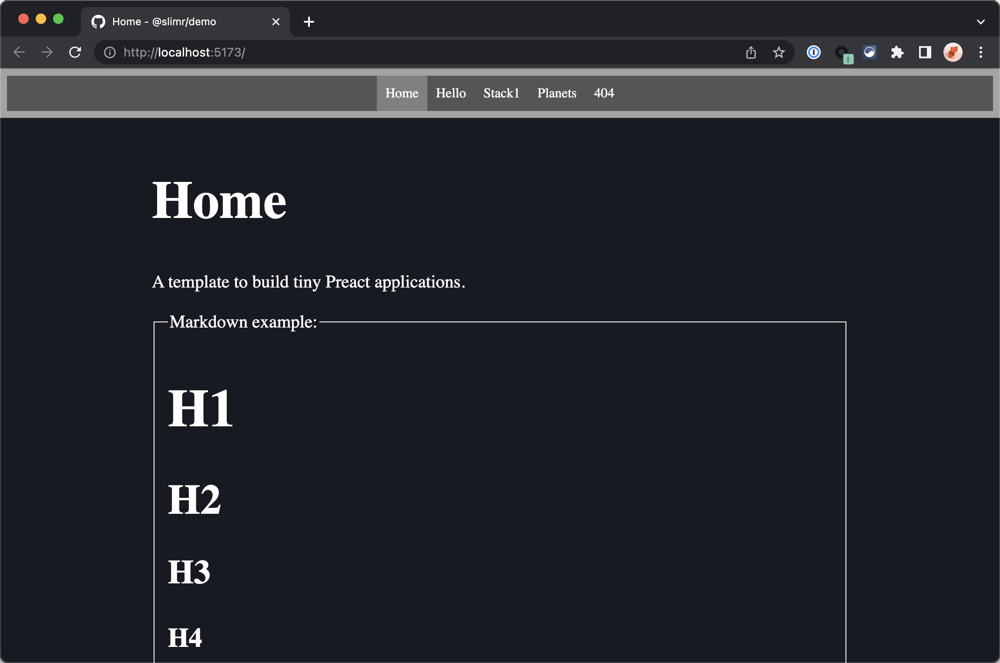

# 🪶 @slimr/demo

A React Vitejs demo of many @slimr libraries. Checkout the scripts in package.json to get started! Checkout the online demo at [the Codesandbox](https://codesandbox.io/p/github/bdombro/slimr/demo?workspaceId=67d2cd74-9d2f-48bb-a660-e4bc5997c1c0)!

## Context

`@slimr` is a set of slim React (hence '@slimr') libs. Check them all out on [github](https://github.com/bdombro/slimr)!

## Running

- To run in dev-mode, all monorepo packages need be installed and built first (`cd ../../; npm i; npm run build`). Then just run `npm start`
- To run the 'demo' git branch, simply `npm i` the `npm start`
